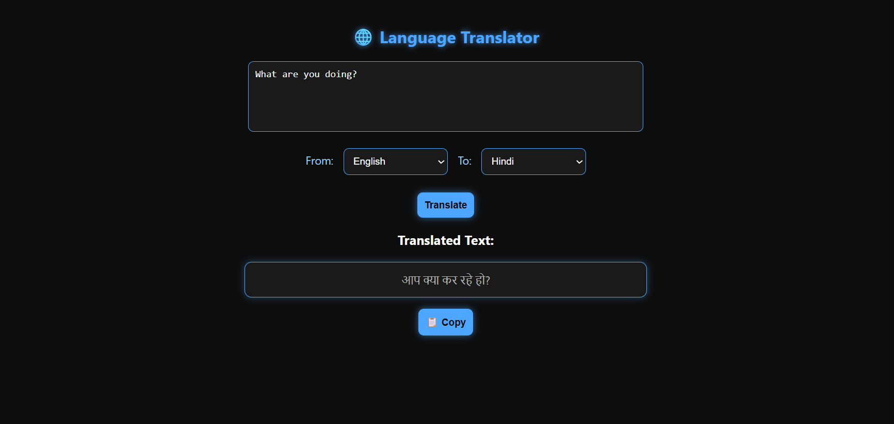

# 🌐 Language Translation Tool

A simple, **efficient**, and **accurate** language translation tool with a clean and **responsive UI** for a smooth user experience.  
It uses a connected **translation API** to instantly convert text from one language to another.  
Designed for ease of use on **mobile, tablet, and desktop** devices.

</div>

---

## 📂 Project Structure
```
Language-Translation-Tool/
│
├── screenshots/                # Images for README (UI previews)
│   ├── demo.png
│
├── static/                      # CSS & JavaScript files
│   ├── style.css                # Styling for the translation tool UI
│   └── script.js                # Frontend logic & API requests
│
├── templates/                   # HTML templates
│   └── index.html               # Main translation interface
│
├── venv/                        # Virtual environment files (ignored by Git)
│
├── .gitignore                   # Git ignore file (venv, __pycache__, etc.)
├── app.py                       # Python backend (Flask server)
├── requirements.txt             # Python dependencies
└── README.md                    # Project documentation
```

---

## 📸 Translation Tool Preview

<p align="center">
  
</p>

---

## 🚀 Features
- 🌍 **Real-time translation** – Instantly converts text between multiple languages  
- 🎯 **Accurate results** – Uses a reliable API for precise translations  
- 📱 **Fully responsive** – Works seamlessly across all devices  
- ⚡ **Fast and lightweight** – Minimal delay with quick processing  
- 🖌 **Clean UI** – Easy-to-use interface for better UX  
- 🔄 **Multiple language support** – Translate between many languages effortlessly  

---

## 📦 Installation & Setup

**If using Git clone:**
```bash
# 1️⃣ Clone the repository
git clone https://github.com/hs74-codes/Language-Translation-Tool.git

# 2️⃣ Navigate to the project folder
cd Language-Translation-Tool

# 3️⃣ Install dependencies
pip install -r requirements.txt

# 4️⃣ Run the app
python app.py
```

**If using ZIP file:**

```bash
# 1️⃣ Download and extract the ZIP file

# 2️⃣ Navigate to the project folder
cd Language-Translation-Tool

# 3️⃣ Install dependencies
pip install -r requirements.txt

# 4️⃣ Run the app
python app.py
```

📄 License
Project owned and copyrighted by <b>hs74-codes</b>
<br>
All rights reserved. Unauthorized copying or redistribution is prohibited.
